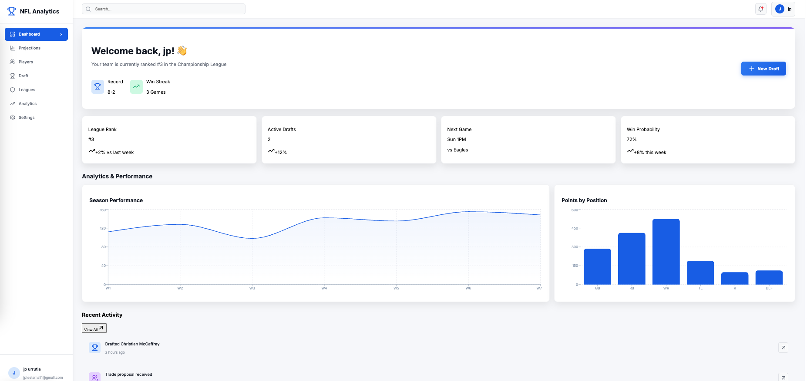
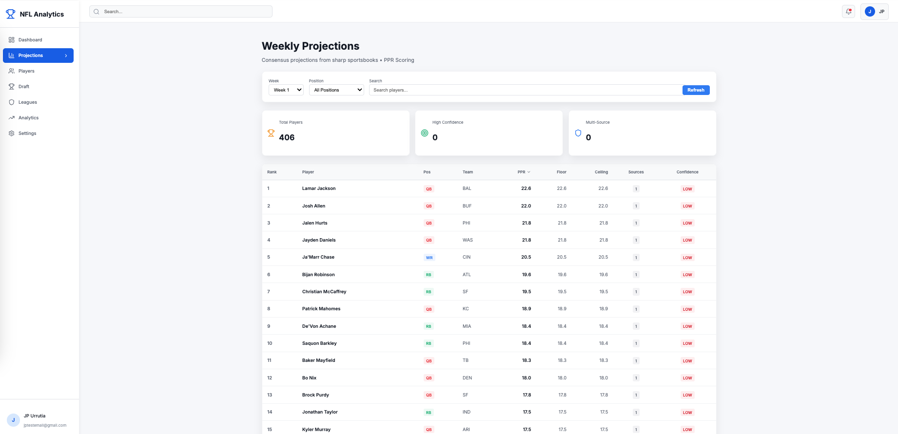
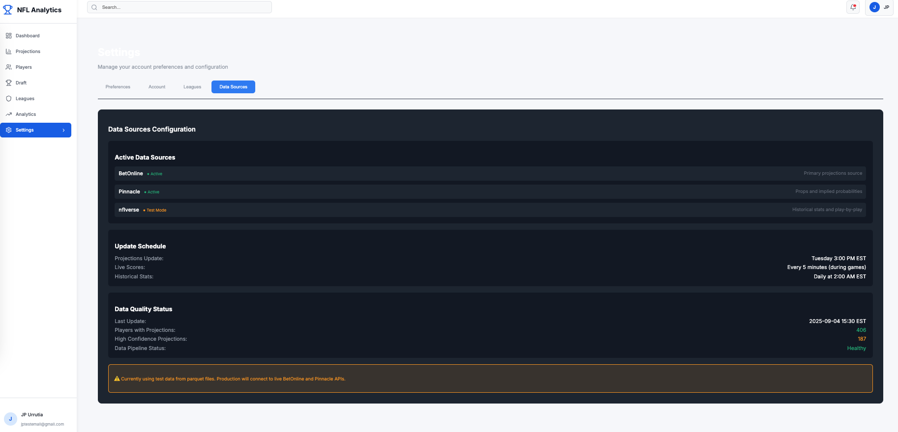
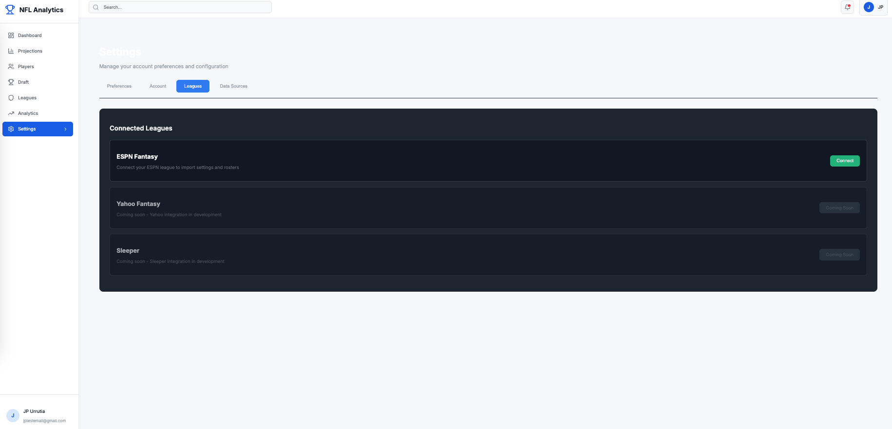

# NFL Fantasy Analytics Platform

A comprehensive, data-driven fantasy football analytics platform that provides personalized insights for dominating fantasy leagues.

## Demo

### Screenshots

#### Dashboard Overview

*Interactive dashboard with real-time fantasy analytics and player performance metrics*

#### Player Projections

*Comprehensive player projections with consensus data and fantasy point estimates*

#### Data Sources

*Multiple data source integrations for comprehensive analysis*

#### API Connectors

*Seamless integration with various fantasy football data providers*

## Features

- **Player Projections**: Real-time fantasy point projections with consensus data
- **Advanced Analytics**: Player stats, trends, and performance metrics
- **User Authentication**: Secure registration and login with strong password validation
- **Modern Dashboard**: Interactive charts and visualizations with Recharts
- **Multi-League Support**: Manage multiple fantasy leagues per user account

## Tech Stack

- **Backend**: Go 1.21+ with Gin framework
- **Frontend**: Next.js 14+ with TypeScript and React
- **Databases**: PostgreSQL (transactional), Redis (cache), DuckDB (analytics)
- **Data Pipeline**: Python 3.11+ with pandas
- **Infrastructure**: Docker & Docker Compose
- **Authentication**: JWT tokens with secure cookie storage

## Quick Start

### Prerequisites

- Docker Desktop installed and running
- Git for version control
- 8GB+ RAM recommended for running all services

### Setup & Running the Project

1. **Clone the repository:**
```bash
git clone <repository-url>
cd nfl-analytics-app
```

2. **Start all services with Docker Compose:**
```bash
docker-compose up -d
```

This command will:
- Build all Docker images if needed
- Start PostgreSQL database on port 5432
- Start Redis cache on port 6379
- Start Go backend API on port 8080
- Start Next.js frontend on port 3000
- Start Python data pipeline

3. **Wait for services to be ready (about 30 seconds):**
```bash
# Check status of all services
docker-compose ps

# View logs if needed
docker-compose logs -f
```

4. **Access the application:**
- **Frontend**: http://localhost:3000
- **Backend API**: http://localhost:8080
- **Health Check**: http://localhost:8080/health

5. **Create an account:**
- Navigate to http://localhost:3000/register
- Password requirements:
  - Minimum 12 characters
  - At least 1 uppercase letter
  - At least 1 lowercase letter
  - At least 1 number
  - At least 1 special character
  - No common passwords or patterns

### Stopping the Application

```bash
# Stop all containers (preserves data)
docker-compose down

# Stop and remove all data (fresh start)
docker-compose down -v
```

### Restarting Services

```bash
# Restart all services
docker-compose restart

# Restart specific service
docker-compose restart frontend
docker-compose restart backend
```

## Project Structure

```
nfl-analytics-app/
├── frontend/           # Next.js application
│   ├── app/           # Next.js 14 app directory
│   ├── components/    # React components
│   ├── lib/          # Utilities and API clients
│   └── package.json  # Frontend dependencies
├── backend/           # Go API server
│   ├── cmd/          # Application entrypoint
│   ├── internal/     # Internal packages
│   └── go.mod        # Go dependencies
├── data-pipeline/     # Python ETL scripts
│   └── requirements.txt
├── docker/            # Dockerfile configurations
├── docker-compose.yml # Service orchestration
└── README.md         # This file
```

## Environment Variables

The application uses these environment variables (set in docker-compose.yml):

### Frontend
- `NEXT_PUBLIC_API_URL`: http://localhost:8080 (browser to backend)
- `BACKEND_URL`: http://backend:8080/api (server-side to backend)

### Backend
- `POSTGRES_HOST`: postgres
- `POSTGRES_DB`: fantasy_football
- `POSTGRES_USER`: app_user
- `POSTGRES_PASSWORD`: secure_password_change_me
- `JWT_SECRET`: your_jwt_secret_change_me
- `REDIS_HOST`: redis

## Common Commands

### View logs
```bash
# All services
docker-compose logs -f

# Specific service
docker-compose logs -f frontend
docker-compose logs -f backend
```

### Execute commands in containers
```bash
# Install npm packages in frontend
docker exec nfl_frontend npm install package-name

# Run Go commands in backend
docker exec nfl_backend go mod tidy

# Access PostgreSQL
docker exec -it nfl_postgres psql -U app_user -d fantasy_football
```

### Rebuild after code changes
```bash
# Rebuild and restart specific service
docker-compose up -d --build frontend

# Rebuild everything
docker-compose up -d --build
```

## Troubleshooting

### Port already in use
If you see "bind: address already in use" errors:
```bash
# Find process using port (e.g., 3000)
lsof -i :3000

# Kill the process
kill -9 <PID>
```

### Frontend not loading
1. Check frontend logs: `docker logs nfl_frontend`
2. Clear Next.js cache: `docker exec nfl_frontend rm -rf .next`
3. Restart: `docker-compose restart frontend`

### Backend API errors
1. Check backend logs: `docker logs nfl_backend`
2. Verify database is running: `docker-compose ps postgres`
3. Restart backend: `docker-compose restart backend`

### Registration failing
- Ensure password meets all requirements (12+ chars, uppercase, lowercase, number, special char)
- Check if email is already registered
- Verify backend is running: `curl http://localhost:8080/health`

### Database connection issues
```bash
# Recreate database
docker-compose down -v
docker-compose up -d
```

## Development Workflow

1. **Frontend Development:**
   - Edit files in `/frontend`
   - Changes auto-reload via Next.js hot reload
   - View at http://localhost:3000

2. **Backend Development:**
   - Edit files in `/backend`
   - Changes auto-reload via Air (Go hot reload)
   - API at http://localhost:8080

3. **Database Changes:**
   - Add migrations in `/backend/internal/database/migrations`
   - Restart backend to apply: `docker-compose restart backend`

## Testing

```bash
# Backend tests
docker exec nfl_backend go test ./...

# Frontend tests (if configured)
docker exec nfl_frontend npm test

# API health check
curl http://localhost:8080/health
```

## API Endpoints

### Authentication
- `POST /api/auth/register` - Create new account
- `POST /api/auth/login` - Login to existing account
- `POST /api/auth/logout` - Logout current user

### Projections
- `GET /api/projections` - Get player projections
  - Query params: `week`, `season`, `limit`, `position`
- `GET /api/projections/player/:name` - Get specific player projection

### User
- `GET /api/users/profile` - Get current user profile
- `PUT /api/users/profile` - Update user profile

## Security Notes

⚠️ **For Development Only** - The current setup uses default passwords and secrets. For production:
1. Change all passwords in docker-compose.yml
2. Use environment-specific .env files
3. Enable HTTPS
4. Use proper secrets management
5. Configure firewall rules
6. Regular security updates

## Contributing

1. Fork the repository
2. Create a feature branch (`git checkout -b feature/amazing-feature`)
3. Commit your changes (`git commit -m 'Add amazing feature'`)
4. Push to the branch (`git push origin feature/amazing-feature`)
5. Open a Pull Request

## License

Private - All rights reserved

## Support

For issues or questions, please open a GitHub issue.

---

**Last Updated**: September 2025